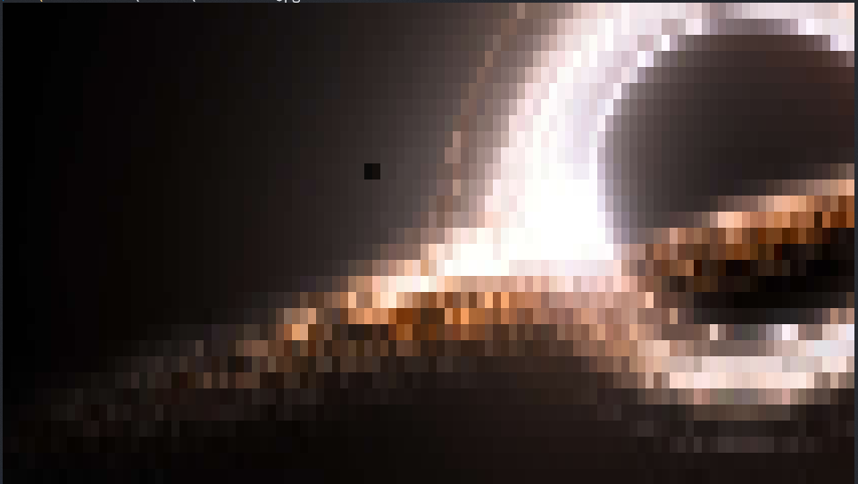
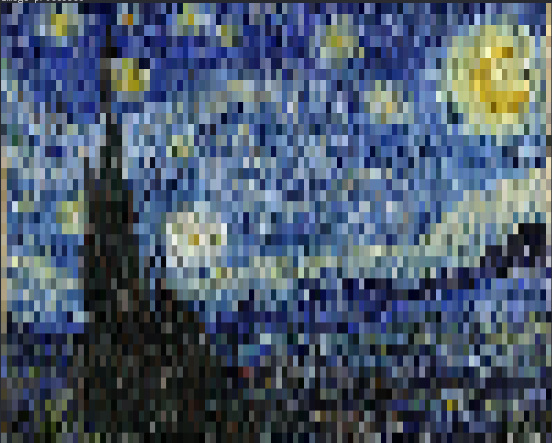

# ConsoleImage
Display image in console using specified characters

------

### Build Guide

__Requirements__:  
* C++17 compiler  
* cmake  
* GPU supporting OpenGL >= 3.3  

Only tested on Linux & Windows

__Commands__:

```bash
git submodule update --init --recursive
mkdir build && cd build
cmake ..
make -j4
```

Or (on Windows)  
```bash
cmake --build . --config Release
```

Executable will be generated in folder `bin`

------

### Command Arguments

```powershell
.\show.exe -h
Usage: ConsoleImage [options] filepath

Positional arguments:
filepath        image path to display [required]

Optional arguments:
-h --help       shows help message and exits
-v --version    prints version information and exits
-v --verbose    show processing details [default: false]
--color         colored output [default: false]
-s --size       number of lines (size) to display (val > 0) [default: 20]
-c --chars      characters to use (dark to light) [default: {}]
```

------

### Demo

```powershell
.\show.exe ..\assets\apple.png -s 30
```


```powershell
.\show.exe ..\assets\monalisa.jpg -s 50
```


```powershell
.\show.exe ..\assets\lion.jpg -s 40 -c " " -c "." -c "&"
```


```powershell
.\show.exe ..\assets\blackhole.jpg -s 30 --color -c " "
```


```powershell
.\show.exe ..\assets\starrynight.jpg --color -c " " -s 40 --verbose
Arguments parsed
Image loaded: ..\assets\starrynight.jpg
OpenGL context created
Image processed
```


------

### Future Improvements

Add edge detection kernel to improve output visual  
~~Add colored image output~~  
~~Wait for C++17 new functionalities for converting `std::string` to `std::wstring`, or use 3rd party library for it~~  
Extend functionality to play videos in terminal (another project)  