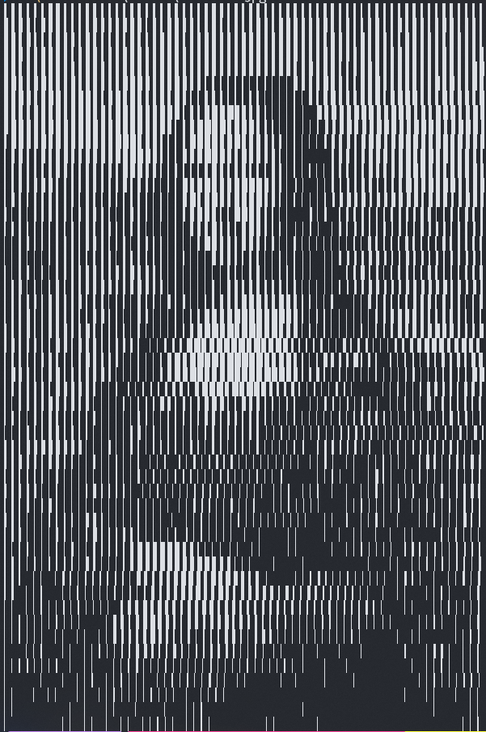
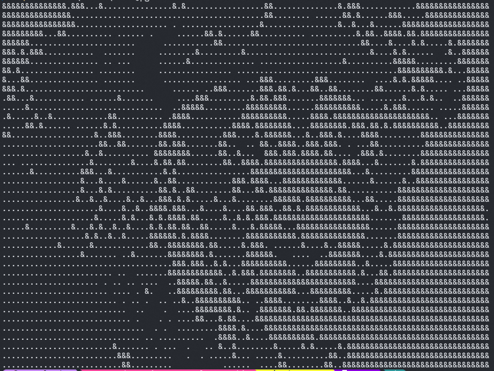

# ConsoleImage
Display image in console using specified characters

------

### Build Guide

__Requirements__:  
* C++17 compiler  
* cmake  
* GPU supporting OpenGL >= 3.3  

__Commands__:

```bash
mkdir build && cd build
cmake ..
make -j4
```

Or (on Windows)  
```bash
cmake --build . --config Release
```

Executable will be generated in folder `bin`

------

### Demo






------

### Future Improvements

Add edge detection kernel to improve output visual