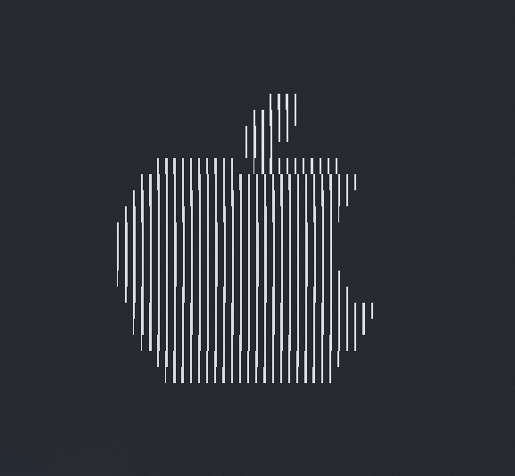

# ConsoleImage
Display image in console using specified characters

------

### Build Guide

__Requirements__:  
* C++17 compiler  
* cmake  
* GPU supporting OpenGL >= 3.3  

Only tested on Linux & Windows

__Commands__:

```bash
git submodule update --init --recursive
mkdir build && cd build
cmake ..
make -j4
```

Or (on Windows)  
```bash
cmake --build . --config Release
```

Executable will be generated in folder `bin`

------

### Command Arguments

```powershell
.\show.exe -h
Usage: ConsoleImage [options] filepath

Positional arguments:
filepath        image path to display [required]

Optional arguments:
-h --help       shows help message and exits
-v --version    prints version information and exits
--verbose       show processing details [default: false]
-s --size       number of lines (size) to display (val > 0) [default: 20]
-c --chars      characters to use (dark to light) [default: " .:*+o&8@"]
```

------

### Demo




------

### Future Improvements

Add edge detection kernel to improve output visual